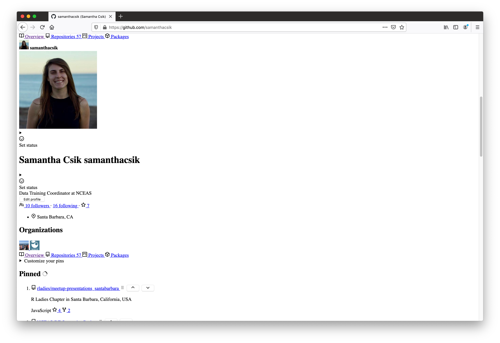
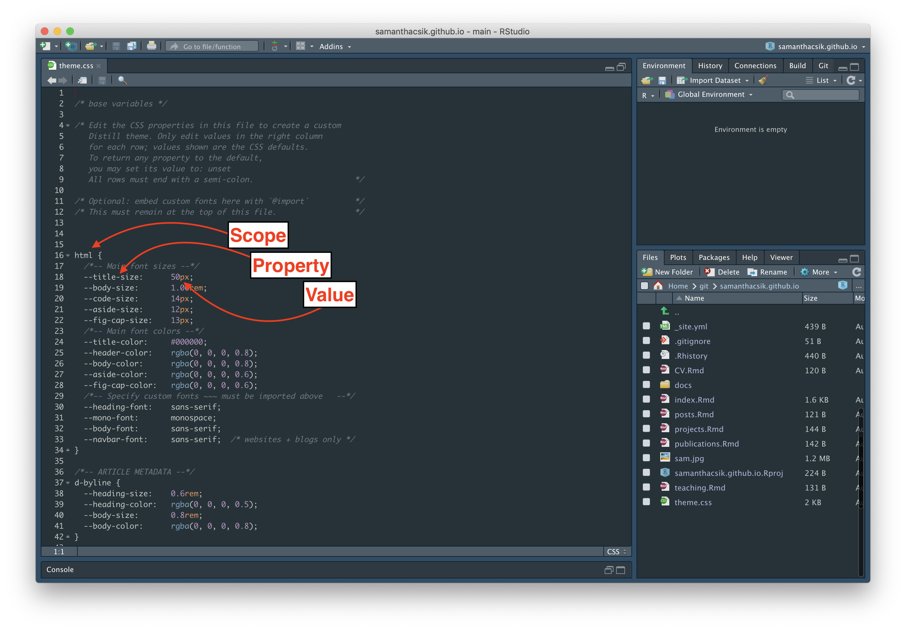

```{r setup, include=FALSE}
options(htmltools.dir.version = FALSE)
knitr::opts_chunk$set(
  fig.width = 9, fig.height = 3.5, fig.retina = 3,
  out.width = "100%",
  cache = FALSE,
  echo = TRUE,
  message = FALSE, 
  warning = FALSE,
  hiline = TRUE
)
```

```{r xaringan-themer, include = FALSE, warning = FALSE}
# load package
library(xaringanthemer)

# set accent theme
style_mono_accent(
  header_font_google = google_font("Josefin Sans"), # Text Me One
  text_font_google = google_font("Glacial Indifference", "300", "300i"),
  code_font_google = google_font("Fira Mono"),
  base_color = "#05859B",
  white_color = "#93C6C2",
  background_color = "#FFFFFF",
  header_font_weight = 400,
  header_h1_font_size = "2.25rem",
  header_h2_font_size = "1.75rem",
  header_h3_font_size = "1.5rem",
  footnote_font_size = "0.7em",
)
```

## So you've created your personal website using `{distill}`...

[`{distill}`](https://rstudio.github.io/distill/) gives us with an easy-to-use web publishing format to create our personal websites. A massive benefit is that these websites already look pretty slick right out of the box. 

.center[
```{r echo = FALSE, out.width = '55%'}
knitr::include_graphics("img/sam_distill.png")
```
]

---
## But without some additional modifications, it can be challenging to make *your* website stand out from the rest. 

<br>

.center[
```{r echo = FALSE, out.width = '55%'}
knitr::include_graphics("img/unique.gif")
```
]

<br>

In order to make those changes, we need to dive a bit into the world of **CSS**. Some of you may have already heard of and/or used CSS -- that's great! We're going to spend a few minutes first learning about what makes a web page...look like a web page, then apply what we learn to our own `{distill}` sites.

---
## HTML & CSS are the building blocks of web pages

**HTML** (Hypertext Markup Language) is a *markup language<sup>1</sup>* that tells web browsers how to *structure* web pages. You can think of HTML as the *skeleton* of a web page. It gives authors the means to create things like headings, text, tables, lists, add media, etc.

**CSS** (Cascading Style Sheets) is a programming language that allows you to control how HTML elements *look* on a web page. You can think of CSS as the *outfit* that is styling the skeleton. It allows authors to control aspects such as the colors, layout, and font style.

.center[
```{r echo = FALSE, out.width = '40%'}
knitr::include_graphics("img/html_css_lego.jpeg")
```
]

.center[
Source: Nicolas Karasiak, [GitHub: nkaraskiak/Illustration](https://github.com/nkarasiak/Illustration/tree/master/LegoJavascript)
]

.footnote[
<sup>1</sup> **[Markdown](https://www.markdownguide.org/)** and **[R Markdown](https://rmarkdown.rstudio.com/)** are both lightweight markup languages -- they're a bit easier for humans to write and read than HTML. HTML is more expressive and allows for customization that is difficult or impossible to do in Markdown.
]

---
## Your browser has its own internal style sheet to render HTML

.center[
Your browser will style HTML documents using an internal style sheet, which ensures that headings are larger than normal text, links are highlighted, lists and tables are structured correctly, etc.
]

.pull-left[
```{r echo = FALSE, out.width = '100%'}

```
.center[
HTML
]
]

.pull-right[
```{r echo = FALSE, out.width = '100%'}

```
.center[
Browser default styling
]
]

---

## CSS adds **pizzazz** to web page renderings

.center[
CSS allows website developers to add additional styling to web browser defaults. Otherwise, websites would be pretty boring to look at (and they'd all generally look the same).
]

.pull-left[
```{r echo = FALSE, out.width = '100%'}

```
.center[
Browser default styling
]
]

.pull-right[
```{r echo = FALSE, out.width = '100%'}

```
.center[
CSS styling
]
]

---
## A *light* introduction to HTML

HTML consists of a series of **elements**, comprised of **opening tags** and **closing tags** that render some form of content in a particular way.

.center[
**The basic anatomy of an HTML element:**
]

.center[
```{r echo = FALSE, out.width = '60%'}

```
]

<br>

.footnote[
In R Markdown syntax: `# Welcome to your first MEDS mini-workshop`

Source: [“Getting Started with HTML - Learn Web DEVELOPMENT: MDN.” Learn Web Development | MDN, developer.mozilla.org/en-US/docs/Learn/HTML/Introduction_to_HTML/Getting_started.](https://developer.mozilla.org/en-US/docs/Learn/HTML/Introduction_to_HTML/Getting_started) 
]

---
## A *light* introduction to HTML

You can also *nest* elements. Remember to close out tags from the inside-out to avoid unexpected renderings.

<br>
 
.center[
**Nested HTML elements:**
]
.center[
```{r echo = FALSE, out.width = '60%'}

```
]

<br>

.footnote[
In R Markdown syntax: `# Welcome to your first **MEDS** mini-workshop` 

Source: [“Getting Started with HTML - Learn Web DEVELOPMENT: MDN.” Learn Web Development | MDN, developer.mozilla.org/en-US/docs/Learn/HTML/Introduction_to_HTML/Getting_started.](https://developer.mozilla.org/en-US/docs/Learn/HTML/Introduction_to_HTML/Getting_started) 
]

---
## A *light* introduction to HTML

HTML elements can also have **attributes** which contain extra information about the element that will not be rendered as visual content on the web page. Attributes can be used in many powerful ways, but one is to target subsets of elements for styling with CSS.

.center[
**Anatomy of an attribute:**
]

<!-- .center[ -->
<!-- ```{r echo = FALSE, out.width = '60%'} -->
<!-- knitr::include_graphics("img/attribute.png") -->
<!-- ``` -->
<!-- ] -->

---
# Some commonly used html elements

* `<h1></h1>`: creates a first-level heading (largest)
* `<h6></h6>`: creates a sixth-level (smallest)
* `<p></p>`: begins a new paragraph
* `<br></br>`: adds a line break 
* `<a href =></a>`:
* `<b></b>` or `<strong></strong>`: bolded text
* `<i></i>` or `<em></em>`: italicized text

---
## A *light* introduction to CSS

CSS is a rule-based language, meaning that it allows you to define groups of styles that should be applied to particular elements or groups of elements on a web page. For example, *"I want all first-level (`<h1>`) headings to be large green text"* would be coded as:

.pull-left[
```{r echo = FALSE, out.width = '100%'}
knitr::include_graphics("img/CSS_syntax.png")
```
]

.pull-right[
* **Selectors** select the HTML element to style *(e.g. first-level headings, `<h1>`)*
* **Declarations** sit inside curly brackets, `{}`, and are made up of **property** and **value** pairs. Each pair specifies the property of the HTML element(s) you're selecting *(e.g. the color property of the element `<h1>`)*, and a value you'd like to assign that property *(e.g. green)*
* A property and its corresponding value are separated by a colon, `:`. Declarations end with a semicolon, `;`
]

<br>

.footnote[
Source: [“What Is CSS? - Learn Web Development: MDN.” Learn Web Development | MDN, developer.mozilla.org/en-US/docs/Learn/CSS/First_steps/What_is_CSS.](https://developer.mozilla.org/en-US/docs/Learn/CSS/First_steps/What_is_CSS) 
]

---
## "Inspect"ing web pages allows you to view and edit HTML & CSS source code

*Don't worry -- any edits you make are only visible to you and will disappear if you refresh the web page!* Using the "Inspect" tool is a great way to get a better sense of how CSS is used to modify particular HTML elements.

Navigate to any web page and *right click* on an element of interest (e.g. text, images, links, etc.) and choose *Inspect* to pull up the underlying HTML & CSS files. Here, I am going to  inspect the yellow dot, which tells users that the respository, `rladies/meetup-presentations_santabarbara`, contains JavaScript files.

.center[
```{r echo = FALSE, out.width = '50%'}

```
]

---
## Make some edits to a web page's style by altering declaration values

.center[
```{r echo = FALSE, out.width = '70%'}

```
]

---
## Make some edits to a web page's style by altering declaration values

.center[
```{r echo = FALSE, out.width = '70%'}

```
]

---
## Check out your web page with its "edited" CSS!

.center[
```{r echo = FALSE, out.width = '65%'}
knitr::include_graphics("img/big_dots.png")
```
]

.center[
*Refreshing the web page will revert any changes you made.*
]
---
## Okay that was like...

<br>

.center[
```{r echo = FALSE, out.width = '50%'}

```
]

<br>

.center[
But what's even *more* magical is how easy `{distill}` makes it to customize your site's CSS.
]

---
## Start by making sure you have a CSS file in your web page repo's root directory

If you do not already have a `.css` file, you can generate one by running the `distill::create_theme()` function in your console as follows:

```{r, eval = FALSE}

# the `name` argument sets the name of the theme file, e.g. `theme.css`
# the `edit` argument opens an editor (in RStudio) for the theme file

distill::create_theme(name = "theme", edit = TRUE)
```

--

This function creates a file named `theme` with the file extension `.css`. Here is where you will define CSS custom properties and/or edit existing default values. You'll notice that there are a series of CSS rules, that should look similar to the example shown earlier (slide 11 - LINK THIS). They take the format:

```{r, eval = FALSE}
scope { # think of 'scope' as the 'selector'
  --some-property:       some-value; # e.g. --code-size:    50px;
  --another-property:    another-value; # e.g.  --title-color:   #333CFF;
}
```

.footnote[
This content has been adapted from the `{distill}` document on theming. This is a *great* resource for getting started on web page customization. You can find that [here](https://rstudio.github.io/distill/website.html#theming).
]

---
## The 'out-of-the-box' `theme.css` file

.center[
```{r echo = FALSE, out.width = '70%'}

```
]

---
## Apply your theme to your `{distill}` website

Add a theme key to the top-level of your `_site.yaml` configuration file along with the name of your `.css` file (e.g. mine is named `theme.css`). For example:

```{r, eval = FALSE}
name: "samanthacsik.github.io"
title: "Samantha Csik"
{{theme: theme.css}}
description: |
  Samantha Csik
output_dir: "docs"
navbar:
  right:
    - text: "Home"
      href: index.html
    - text: "Publications"
      href: publications.html
    - text: "Posts"
      href: posts.html
    - text: "Projects"
      href: projects.html
    - text: "Teaching"
      href: teaching.html
    - text: "Curriculum Vitae"
      href: CV.html
output: distill::distill_article

```

---
## Edits we'll make today (EDIT THIS)

1. Changing default theme values
  a. Banner colors
  b. Font size
2. Apply a custom Google font(s)
3. Add your very own custom CSS rules
4. coder's life hack: drawing inspriation from other distill sties

---
# Change default theme values

[HTML color picker](https://htmlcolorcodes.com/color-picker/)
[Colorpick Eyedropper - Chrome Extention](https://chrome.google.com/webstore/detail/colorpick-eyedropper/ohcpnigalekghcmgcdcenkpelffpdolg?hl=en)

---
## Import & use custom Google Fonts

[Google Fonts](https://fonts.google.com/)

---
class: center, middle

# Now get to customizing!

```{r echo = FALSE, out.width = '60%'}

```

Slides created via the R packages:

[**xaringan**](https://github.com/yihui/xaringan)<br>
[**gadenbuie/xaringanthemer**](https://github.com/gadenbuie/xaringanthemer)

