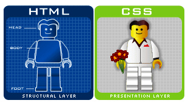
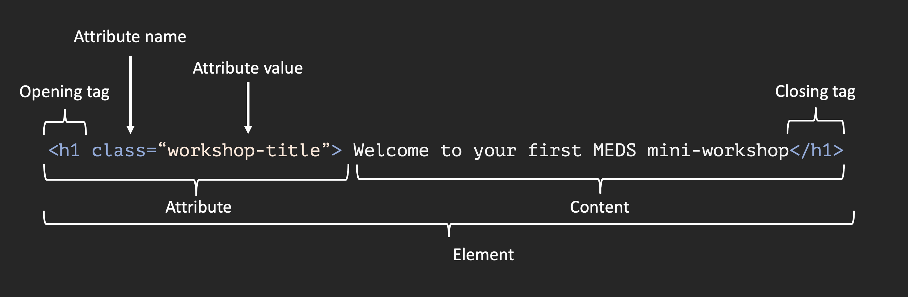

```{r setup, include=FALSE}
options(htmltools.dir.version = FALSE)
knitr::opts_chunk$set(
  fig.width = 9, fig.height = 3.5, fig.retina = 3,
  out.width = "100%",
  cache = FALSE,
  echo = TRUE,
  message = FALSE, 
  warning = FALSE,
  hiline = TRUE
)
```

```{r xaringan-themer, include = FALSE, warning = FALSE}
# load package
library(xaringanthemer)

# set accent theme
style_mono_accent(
  header_font_google = google_font("Josefin Sans"), # Text Me One
  text_font_google = google_font("Glacial Indifference", "300", "300i"),
  code_font_google = google_font("Fira Mono"),
  base_color = "#05859B",
  white_color = "#93C6C2",
  background_color = "#FFFFFF",
  header_font_weight = 400,
  header_h1_font_size = "2.25rem",
  header_h2_font_size = "1.75rem",
  header_h3_font_size = "1.5rem",
  footnote_font_size = "0.7em",
)
```

```{css, echo = FALSE, message = FALSE, warning = FALSE}
.remark-code { 
  font-family: 'Source Code Pro', 'Lucida Console', Monaco, monospace;
  font-size: 70%;
 }

```

## Prerequisites 

You should already have a `{distill}` website (or at least the bones of one) deployed using github pages. Importantly, this website should also have *some* content (e.g. text, headings, etc.) for us to customize.

If you first need to get your website up and running, follow along with these [step-by-step instructions](https://docs.google.com/document/d/1c0SZiVvp32UTJ9sK_yVjI8ou6pVdFRXsY2236tiTA1c/edit) by Allison Horst before moving forward.

---
## So you've created your personal website using `{distill}`...

[`{distill}`](https://rstudio.github.io/distill/) gives us with an easy-to-use web publishing format to create our personal websites. A massive benefit is that these websites already look pretty slick right out of the box. 

.center[
```{r echo = FALSE, out.width = '55%'}
knitr::include_graphics("img/sam_distill.png")
```
]

---
## But without some additional modifications, it can be challenging to make *your* website stand out from the rest. 

<br>

.center[
```{r echo = FALSE, out.width = '55%'}
knitr::include_graphics("img/unique.gif")
```
]

<br>

In order to make those changes, we need to dive a bit into the world of **CSS**. Some of you may have already heard of and/or used CSS -- that's great! We're going to spend a few minutes first learning about what makes a web page...look like a web page, then apply what we learn to our own `{distill}` sites.

---
## HTML & CSS are the building blocks of web pages

**HTML** (Hypertext Markup Language) is a *markup language<sup>1</sup>* that tells web browsers how to *structure* web pages. You can think of HTML as the *skeleton* of a web page. It gives authors the means to create elements like headings, text, tables, lists, add media, etc.

**CSS** (Cascading Style Sheets) is a programming language that allows you to control how HTML elements *look* on a web page. You can think of CSS as the *outfit* that is styling the skeleton. It allows authors to control aspects such as the colors, layout, and font style.

.center[
```{r echo = FALSE, out.width = '35%'}

```
]

.center[
Source: Nicolas Karasiak, [GitHub: nkaraskiak/Illustration](https://github.com/nkarasiak/Illustration/tree/master/LegoJavascript)
]

<br> 

.footnote[
<sup>1</sup> **[Markdown](https://www.markdownguide.org/)** and **[R Markdown](https://rmarkdown.rstudio.com/)** are both lightweight markup languages -- they're a bit easier for humans to write and read than HTML. HTML is more expressive and allows for customization that is difficult or impossible to do in Markdown.
]

---
## Your browser has its own internal style sheet to render HTML

.center[
Your browser will style HTML documents using an internal style sheet, which ensures that headings are larger than normal text, links are highlighted, lists and tables are structured correctly, etc.
]

.pull-left[
```{r echo = FALSE, out.width = '100%'}
knitr::include_graphics("img/website_html.png")
```
.center[
HTML
]
]

.pull-right[
```{r echo = FALSE, out.width = '100%'}
knitr::include_graphics("img/website_basic_styling.png")
```
.center[
Browser default styling
]
]

---

## CSS adds **pizzazz** to web page renderings

.center[
CSS allows website developers to add additional styling to web browser defaults. Otherwise, websites would be pretty boring to look at (and they'd all generally look the same).
]

.pull-left[
```{r echo = FALSE, out.width = '100%'}
knitr::include_graphics("img/website_basic_styling.png")
```
.center[
Browser default styling
]
]

.pull-right[
```{r echo = FALSE, out.width = '100%'}
knitr::include_graphics("img/website_with_css.png")
```
.center[
CSS styling
]
]

---
## A *light* introduction to HTML - elements

HTML consists of a series of **elements**, comprised of **opening tags** and **closing tags** that render some form of content in a particular way.

.center[
**The basic anatomy of an HTML element:**
]

.center[
```{r echo = FALSE, out.width = '60%'}
knitr::include_graphics("img/element.png")
```
]

<br>

.footnote[
In R Markdown syntax: `# Welcome to your first MEDS mini-workshop`

Source: [“Getting Started with HTML - Learn Web DEVELOPMENT: MDN.” Learn Web Development | MDN, developer.mozilla.org/en-US/docs/Learn/HTML/Introduction_to_HTML/Getting_started.](https://developer.mozilla.org/en-US/docs/Learn/HTML/Introduction_to_HTML/Getting_started) 
]

---
## A *light* introduction to HTML - nested elements

You can also *nest* elements. Remember to close out tags from the inside-out to avoid unexpected renderings.

<br>
 
.center[
**Nested HTML elements:**
]
.center[
```{r echo = FALSE, out.width = '60%'}
knitr::include_graphics("img/nested_elements.png")
```
]

<br>

.footnote[
In R Markdown syntax: `# Welcome to your first **MEDS** mini-workshop` 

Source: [“Getting Started with HTML - Learn Web DEVELOPMENT: MDN.” Learn Web Development | MDN, developer.mozilla.org/en-US/docs/Learn/HTML/Introduction_to_HTML/Getting_started.](https://developer.mozilla.org/en-US/docs/Learn/HTML/Introduction_to_HTML/Getting_started) 
]

---
## A *light* introduction to HTML - attributes

HTML elements can also have **attributes** which contain extra information about the element that will not be rendered as visual content<sup>1</sup> on the web page. Attributes can be used in many powerful ways -- one way is to provide a class or ID as an identifier to be used for targeted styling with CSS. We will come back to this concept in a little bit.

.center[
**The basic anatomy of an attribute:**
]

.center[
```{r echo = FALSE, out.width = '65%'}

```
]

<br> 

.footnote[
<sup>1</sup>One example that you may already be familiar with is **alt text**. While you add alt text to the top of code chunks, knitting your `.Rmd` will actually add that text as an attribute on the visual content you generate (e.g. a `ggplot`) -- you cannot see it rendered on the screen, but screen readers can find it by searching for any content with the `alt` attribute to read aloud for visually impaired users.

Source: [“Getting Started with HTML - Learn Web DEVELOPMENT: MDN.” Learn Web Development | MDN, developer.mozilla.org/en-US/docs/Learn/HTML/Introduction_to_HTML/Getting_started.](https://developer.mozilla.org/en-US/docs/Learn/HTML/Introduction_to_HTML/Getting_started) 
]


---
# Some commonly used html elements

* `<div></div>`: group common elements
* `</img>`: present an image
* `<h1></h1>`: creates a first-level heading (largest)
* `<h6></h6>`: creates a sixth-level (smallest)
* `<p></p>`: begins a new paragraph
* `<br></br>`: adds a line break 
* `<strong></strong>`: bolded text
* `<em></em>`: italicized text
* `<a></a>`: anchors (i.e. links) an HTML page to another page 
    * e.g. `<a href="https://ucsb-meds.github.io/">text_I_want_to_hyperlink</a>`)
* `<span></span>`: an inline container used to markup part of a text or document
    * e.g. `My favorite color is <span style="color:green">green</span>.`

---
## A *light* introduction to CSS

CSS is a rule-based language, meaning that it allows you to define groups of styles that should be applied to particular elements or groups of elements on a web page. For example, *"I want all first-level (`<h1>`) headings to be large green text"* could be coded as:

.pull-left[
```{r echo = FALSE, out.width = '100%'}

```
]

.pull-right[
* **Selectors** define a condition to match HTML elements *(e.g. first-level headings, `<h1>`)*
* **Declarations** sit inside curly brackets, `{}`, and are made up of **property** and **value** pairs. Each pair specifies the property of the HTML element(s) you're selecting *(e.g. the color property of the element `<h1>`)*, and a value you'd like to assign that property *(e.g. green)*
* A property and its corresponding value are separated by a colon, `:`. Declarations end with a semicolon, `;`
]

<br>

.footnote[
Source: [“What Is CSS? - Learn Web Development: MDN.” Learn Web Development | MDN, developer.mozilla.org/en-US/docs/Learn/CSS/First_steps/What_is_CSS.](https://developer.mozilla.org/en-US/docs/Learn/CSS/First_steps/What_is_CSS) 
]

---
## "Inspect"ing web pages allows you to view and edit HTML & CSS source code

*Don't worry -- any edits you make are only visible to you and will disappear when you refresh the web page!* Using the "Inspect" tool is a great way to get a better sense of how CSS is used to modify particular HTML elements.

Navigate to any web page and *right click* on an element of interest (e.g. text, images, links, etc.) and choose *Inspect* to pull up the underlying HTML & CSS files. Here, I am going to  inspect the dark blue banner along the top of my `{distill}` website.

.center[
```{r echo = FALSE, out.width = '50%'}

```
]

---
## An "Inspect" roadmap

.center[
```{r echo = FALSE, out.width = '70%'}

```
]

---
## Make some edits to a web page's style by altering declaration values

.center[
```{r echo = FALSE, out.width = '70%'}

```
]

---
## Check out your web page with its "edited" CSS!

.center[
```{r echo = FALSE, out.width = '65%'}

```
]

.center[
*Refreshing the web page will revert any changes you made.*
]
---
## Okay that was like...

<br>

.center[
```{r echo = FALSE, out.width = '50%'}
knitr::include_graphics("img/magic.gif")
```
]

<br>

.center[
But what's even *more* magical is how easy `{distill}` makes it to actually customize parts of your site's appearance using CSS.
]

---
## Start by making sure you have a CSS file in your web page repo's root directory

If you do not already have a `.css` file, you can generate one by running the `distill::create_theme()` function in your console as follows:

```{r, eval = FALSE}

# the `name` argument sets the name of the theme file, e.g. `theme.css`
# the `edit` argument opens an editor (in RStudio) for the theme file

distill::create_theme(name = "theme", edit = TRUE)
```

--

This function creates a file named `theme` with the file extension `.css`. Here is where you will define CSS custom properties and/or edit existing default values. You'll notice that there are a series of CSS rules, that should look similar to the example shown earlier ([slide 12](https://ucsb-meds.github.io/customizing-websites-css/#12)). They take the format:

```{r, eval = FALSE}
scope { # think of 'scope' as the 'selector'
  --some-property:       some-value; # e.g. --code-size:    50px;
  --another-property:    another-value; # e.g.  --title-color:   #333CFF;
}
```

.footnote[
This content has been adapted from the `{distill}` document on theming. This is a *great* resource for getting started on web page customization. You can find that document [here](https://rstudio.github.io/distill/website.html#theming).
]

---
## The 'out-of-the-box' `theme.css` file

.center[
```{r echo = FALSE, out.width = '70%'}
knitr::include_graphics("img/theme_file.png")
```
]

---
## Apply your theme to your `{distill}` website

Add a theme key to the top-level of your `_site.yaml` configuration file along with the name of your `.css` file (e.g. mine is named `theme.css`). For example:

```{r, eval = FALSE}
name: "samanthacsik.github.io"
title: "Samantha Csik"
{{theme: theme.css}}
description: |
  Samantha Csik
output_dir: "docs"
navbar:
  right:
    - text: "Home"
      href: index.html
    - text: "Publications"
      href: publications.html
    - text: "Posts"
      href: posts.html
    - text: "Projects"
      href: projects.html
    - text: "Teaching"
      href: teaching.html
    - text: "Curriculum Vitae"
      href: CV.html
output: distill::distill_article

```

---
## So where do we start styling??

.center[
```{r echo = FALSE, out.width = '35%'}

```
]

---
## Import custom Google Fonts at the top of your `theme.css` file

<br> 

**Steps for applying custom Google fonts:**
1. explore Google font styles [here](https://fonts.google.com/) (there are *many* to choose from)

2. embed the font(s) at the top of your `theme.css` file using the [@import](https://developer.mozilla.org/en-US/docs/Web/CSS/@import) method<sup>1</sup> where prompted (i.e. **before** any rules are specified). Below, I'm importing the fonts, **Caveat** and **Montserrat**.

3. specify your imported font style as values on the appropriate property types (*continued on next slide*)

```{css, eval = FALSE}
/* Optional: embed custom fonts here with `@import`          */
/* This must remain at the top of this file.                 */
@import url('https://fonts.googleapis.com/css2?family=Caveat');
@import url('https://fonts.googleapis.com/css2?family=Montserrat');
```

.footnote[
<sup>1</sup>The Google fonts website will generate the `@import` code for your chosen font. Choose a font family and select a particular style. Click on the *Selected families* icon in the upper right hand corner and choose the `@import` radio button under *Use on the web*. Copy and paste the code into your CSS file.
]

---
# Change default font styles to any of your imported fonts

```{css, eval = FALSE, out.width = '70%'}
html {
  /*-- Main font sizes --*/
  --title-size:      50px;
  --body-size:       1.06rem;
  --code-size:       14px;
  --aside-size:      12px;
  --fig-cap-size:    13px;
  /*-- Main font colors --*/
  --title-color:     #000000; 
  --header-color:    rgba(0, 0, 0, 0.8);
  --body-color:      rgba(0, 0, 0, 0.8);
  --aside-color:     rgba(0, 0, 0, 0.6);
  --fig-cap-color:   rgba(0, 0, 0, 0.6);
  /*-- Specify custom fonts ~~~ must be imported above   --*/
  {{--heading-font:    Montserrat; /* default = sans-serif */}}
  {{--mono-font:       monospace;}}
  {{--body-font:       Caveat; /* default = sans-serif */}}
  {{--navbar-font:     sans-serif;  /* websites + blogs only */}}
}
```
---
## Change default font colors by altering hex color codes<sup>1</sup> or adjusting `rbga()` values<sup>2</sup>

```{css, eval = FALSE}
html {
  /*-- Main font sizes --*/
  --title-size:      50px;
  --body-size:       1.06rem;
  --code-size:       14px;
  --aside-size:      12px;
  --fig-cap-size:    13px;
  /*-- Main font colors --*/
  {{--title-color:     #000000;}}
  {{--header-color:    rgba(0, 0, 0, 0.8);}}
  {{--body-color:      rgba(0, 0, 0, 0.8);}}
  {{--aside-color:     rgba(0, 0, 0, 0.6);}}
  {{--fig-cap-color:   rgba(0, 0, 0, 0.6);}}
  /*-- Specify custom fonts ~~~ must be imported above   --*/
  --heading-font:    sans-serif;
  --mono-font:       monospace;
  --body-font:       sans-serif;
  --navbar-font:     sans-serif;  /* websites + blogs only */
}
```

<br> 

.footnote[
<sup>1</sup>Generate Hex color codes using the [HTML color picker](https://htmlcolorcodes.com/color-picker/), or install the [Colorpick Eyedropper Chrome Extention](https://chrome.google.com/webstore/detail/colorpick-eyedropper/ohcpnigalekghcmgcdcenkpelffpdolg?hl=en), which allows you to select color values directly from web pages. <sup>2</sup>A note on `rgba(red, green, blue, alpha)`: the `red` argument, for example, defines the intensity of red between 0-255 or a % value between 0-100%; the `alpha` argument defines opacity as a number between 0.0 (fully transparent) and 1.0 (fully opaque).
]

---
## Change default font sizes

```{css, eval = FALSE, out.width = '70%'}
html {
  /*-- Main font sizes --*/
  {{--title-size:      50px;}}
  {{--body-size:       1.06rem;}}
  {{--code-size:       14px;}}
  {{--aside-size:      12px;}}
  {{--fig-cap-size:    13px;}}
  /*-- Main font colors --*/
  --title-color:     #000000;}}
  --header-color:    rgba(0, 0, 0, 0.8);
  --body-color:      rgba(0, 0, 0, 0.8);
  --aside-color:     rgba(0, 0, 0, 0.6);
  --fig-cap-color:   rgba(0, 0, 0, 0.6);
  /*-- Specify custom fonts ~~~ must be imported above   --*/
  --heading-font:    sans-serif;
  --mono-font:       monospace;
  --body-font:       sans-serif;
  --navbar-font:     sans-serif;  /* websites + blogs only */
}
```

.footnote[
**Pixels** (`px`) are relative to screen size. For low-dpi (Dots Per Inch) devices, 1px is one device pixel of the display. For high resolution screens, 1px implies multiple device pixels.
]
---
## Defining your own CSS rules may require some "Inspect"ing

Creating custom CSS rules for your web site requires some sleuthing (similar to what we did while "Inspecting" our web page) and an understanding of how to apply [CSS selectors](https://www.w3schools.com/cssref/css_selectors.asp). 

For example, say I want to change the color of the headings, *Biography*, *Education*, and *Experience* on my landing page to pink (hex code <span style="color: #C41A60;">#C41A60</span>). *Inspecting* these headings reveals that they are all `<h3>` elements. 

.pull-left[
```{r echo = FALSE, out.width = '100%'}

```
]

.pull-right[
```{r echo = FALSE, out.width = '100%'}

```
]

---
## Construct custom CSS rules that target groups of elements

Following the [CSS selectors](https://www.w3schools.com/cssref/css_selectors.asp) guide, we can construct a custom CSS rule that will color any `<h3>` element on our website <span style="color: #C41A60;">pink</span>:
```{css, eval = FALSE}
/*-- Additional custom styles --*/
/* Add any additional CSS rules below */
  
h3 {
  color: #C41A60; 
}
```

.center[
```{r echo = FALSE, out.width = '40%'}
knitr::include_graphics("img/pink_h3.png")
```
]

---
## "Cheat" code: you can use *inline* style directly in your `.Rmd` to alter the appearence of web page content

For example, you can use the `<span>` tag styled with CSS to update text in your `.Rmd` file. 

`MA in Ecology, Evolution & Marine Biology, 
<span style="color: #EC100D;">2020</span>` will render as:

.center[
```{r echo = FALSE, out.width = '50%'}

```
]

---
## Get inspired by sites on the [distillery](https://distillery.rbind.io/) and borrow open source code

<br>

.center[
```{r, out.width = '60%', echo = FALSE}
knitr::include_url("https://distillery.rbind.io/")
```
]

.footnote[
One of the more challenging parts of creating custom CSS rules (for newbies like myself) is knowing what **selectors** to use and what is design patterns are even possible. Looking at (and borrowing) source code for other `{distill}` sites can help jump start your own custom CSS styling.
]

---
## Let's try borrowing some code

I came across [Jenna Eagleson's web site](https://jeagleso.github.io/website/) on the [Distillery Showcase](https://distillery.rbind.io/showcase.html) and loved the way her headings appear. You can check out all of her custom CSS rules at the bottom of her website's [theme.css file](https://github.com/jeagleso/website/blob/main/theme.css).

.pull-left[
```{r echo = FALSE, out.width = '100%'}

```
]

.pull-right[
```{r echo = FALSE, out.width = '100%'}

```
]

---
## Adapting custom CSS rules for your own website

I see a rule which styles any `h1` - `h6` heading elements with a particular font-weight, color, and spacing between letters. 
```{css, eval = FALSE}
h1, h2, h3, h4, h5, h6 {
  letter-spacing: 2px;
  font-weight: 300;
  color: #3D5A80;
}
```

I just want to apply the letter-spacing and font weight styles to my headings, so I'll borrow those declarations and omit the color declaration. I'm also going to increase the letter-spacing style from `2px` to `5px`:
```{css, eval = FALSE}
h1, h2, h3, h4, h5, h6 {
  letter-spacing: 5px;
  font-weight: 300;
}
```

---
## Voila!

.pull-left[
```{r echo = FALSE, out.width = '100%'}

```
.center[
Without letter spacing
]
]

.pull-right[
```{r echo = FALSE, out.width = '100%'}

```
.center[
With letter spacing
]
]


---
class: center, middle

## The "other stuff"
<br>
### At this point, that just includes adding your CV to your website

---
## Add your CV to your website

There are a few ways to include your resume/CV on your website. 

1. Translate your CV content into your `.Rmd` using R Markdown syntax 
2. Add a link for visitors to download your CV.pdf 
    * for example: `[Download my CV here](file/path/to/my/cv.pdf)` would render as [Download my CV here](img/SCsik_CV_NCEASDataTrainingCoordinator.pdf)
3. Add a scrollable plugin<sup>1</sup> to render your pdf directly on-screen

```{r, echo = FALSE, message = FALSE, out.width = '100%', out.height = '40%'}
knitr::include_graphics("img/SCsik_CV_NCEASDataTrainingCoordinator.pdf")
```

.footnote[
<sup>1</sup>I'm still trouble-shooting this method...open to any and all tips if you've figured this out already!
]
---
class: center, middle

# Now get to customizing!

```{r echo = FALSE, out.width = '60%'}
knitr::include_graphics("img/hacker.gif")
```

Slides created via the R packages:

[**xaringan**](https://github.com/yihui/xaringan)<br>
[**gadenbuie/xaringanthemer**](https://github.com/gadenbuie/xaringanthemer)

